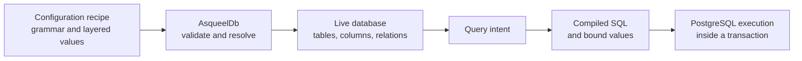

# From configuration to a working database

Asqueel lets an application describe a database once and use logical names
throughout its queries. The main object is `db`. Its tables know their columns,
relations, configuration and shared transaction context:

```python
# db is built from your application's SqlDatabaseConfig recipe.
rows = db.table("sales.customer").query(
    columns="$id, $name", order_by="$id",
).fetch()
```

This page explains the objects behind that expression. You do not need to
construct a compiler or a driver to use it.

## Three stages, three responsibilities



1. **Declare configuration.** A `SqlDatabaseConfig` recipe describes the connection,
   schemas, tables and columns. Builders grammars define which declarations and
   attributes are allowed. Parent recipes and an application or deployment recipe
   can contribute to the same configuration.
2. **Render live objects.** `AsqueelDb(Recipe)` resolves the configuration,
   checks the model and constructs a `SqlDatabase`. Tables, columns and relations
   are stable objects attached to it. No connection is opened and no DDL is run.
3. **Execute operations.** `table.query(...)` records intent. `.fetch()` compiles
   it in the current environment, executes PostgreSQL SQL and returns dictionaries.
   Table writes execute immediately and participate in the shared transaction.

The resolved model is a description, not a row cache. A live `SqlTable` is an
operation handle, not one database record. Editing a returned dictionary does
not save it: call `insert()` or `update()` explicitly.

## Follow a single expression

For `db.table('sales.customer').query(columns='$name').fetch()`:

| Expression | What it gives you | Database I/O? |
|---|---|---|
| `db.table('sales.customer')` | The live table for a logical name. | No |
| `.query(columns='$name')` | A lazy `SqlQuery`. | No |
| `query.sqltext` | SQL compiled for the current environment. | No |
| `query.compiled` | A `CompiledQuery` containing SQL, parameters and metadata. | No |
| `query.fetch()` | A new list of dictionary rows. | Yes |
| `query.execute()` | A new `QueryResult`, including rows and metadata. | Yes |
| `table.record(1)` | A lazy exactly-one record reader. | No |
| `record.output('dict')` | The record's cached snapshot, loading it on first use. | On first use |
| `table.insert(values)` | A `QueryResult` from an executed write. | Yes |

Every query terminal executes again. Inspecting `.sqltext` does not freeze the
next fetch. A record reader, in contrast, keeps its snapshot until `refresh()`.
A saved `CompiledQuery` is fixed and cannot silently follow a changed environment.

## Logical names are application names

`sales.customer` identifies a table in the model. It can map to
`"sales"."customer"`, `"public"."sales_customer"`, or an explicitly named physical
table. `$name` similarly means a logical column, not a literal SQL identifier.

Use `$column` for a local column, `@relation.column` for a declared to-one relation,
and `:parameter` for a value supplied separately. The compiler translates names
and binds values. SQL expressions such as `COALESCE(...)` remain SQL, so their
behavior can still be specific to PostgreSQL.

[Models](models.md) explains naming and UI metadata; [queries](queries.md)
explains the expression vocabulary.

## Configuration, model and live handles

For a live table named `customer`:

| Access | Use it for |
|---|---|
| `customer.config('name_long', default='Customers')` | Reading effective layered configuration. |
| `customer.model` | Inspecting resolved names, keys, columns, relations and policies. |
| `customer.column('name')` | Getting the stable live column handle. |
| `customer.column('name').model.ui` | Reading that column's resolved UI metadata. |
| `customer.relation('...').target` | Following a declared relation to its live target table. |

Treat configuration and model metadata as fixed after construction. Changing
configuration later does not rebuild the live database. Construct a new database
when you need a different configuration.

## Connection, transaction and environment are different

- **Connection configuration** says which PostgreSQL database to contact.
- **Transaction** says which executed operations commit or roll back together.
- **Environment** provides scoped values, such as the current organization, used
  by queries and declared row policies. `connectionName` selects an independent
  named connection; ordinary policy context does not change the database.

Operations start a transaction implicitly. Finish the unit of work with
`db.commit()` or `db.rollback()`. Use `db.tempEnv(...)` to select context and,
when needed, a named connection. An environment scope does not conclude a
transaction.

`db = AsqueelDb(Recipe)` creates a persistent database object. Call
`db.close()` when finished; closing rolls back pending work and never commits. The API is synchronous and the
database must be constructed, used and closed on the same thread.

## A model is not a migration

Declaring a table does not create it. The database must already have the physical
structure that the model expects. The [tutorial](tutorial.md) uses explicit DDL
for a disposable example. Applications can use the separate
[migration integration](migrations.md) to plan and apply schema changes.


Next: run the [quickstart](quickstart.md), then build the [tutorial](tutorial.md).
