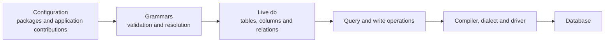

# What is Asqueel?

Asqueel is a Python database layer that makes your application's data model
reusable across queries, business logic and user interfaces. You declare tables,
relationships, calculated fields and UI metadata together. Asqueel turns those
declarations into a live `db` object whose tables can query and change data.

Consider an invoicing application. The customer's display name appears in a
list, a search filter and an export; each field also needs a label for the UI.
Repeating the join, calculation and field description in each consumer makes
them harder to keep consistent. Asqueel lets the model own that knowledge:
a related value or SQL calculation can become a named column, and consumers
can query it or inspect its metadata.

The project brings Genropy's approach to database applications into a standalone
library. Its purpose is to keep a rich application model reusable while retaining
SQL expressions, visible query results and explicit control over writes and
transactions. The current alpha targets PostgreSQL. See
[Current status](limitations.md) for the boundary between implemented behavior
and the broader design described in this manual.

The main object is `db`. Application code works through its tables:

```python
customers = db.table('sales.customer')
rows = customers.query(
    columns='$id, $name, @state_id.name AS state_name',
    where='$name ILIKE :search',
    search='Ada%',
    order_by='$name',
).fetch()
```

This reads customer names and the name of each customer's state. `$name` refers
to a column in the model, `@state_id.name` follows a declared relationship, and
`:search` binds a value separately from SQL. The compiler resolves the physical
table names and the join. You work with a database model without having to
write the join again wherever that relationship is used.

## What belongs in the model?

A column has an identity that applications can follow through several views:

- **Storage:** SQL name, type, size, key and database constraints.
- **Meaning:** relationships, aliases, formulas and application rules.
- **Presentation:** labels, formatting and other UI metadata, attached to the
  column or supplied by linked configuration.

An alias can expose a related value as a column of the table you are querying.
A formula can express a calculation, an existence check or a correlated total.
These definitions can be reused in filters, projections and ordering. A UI
consumer can inspect the same column metadata used by the data layer; it does
not need to maintain an unrelated description of the field.

Asqueel supplies this information to applications. Rendering a form and
choosing its widgets belong to the application or UI framework.

## Configuration becomes an object graph



A configuration recipe declares the model. Cascading grammars define the
vocabulary of each part of that configuration, while package and application
contributions supply its values. Rendering resolves the contributions and
produces the live `db` object graph.

A live table is an object that knows how to query and change records. It is not
one record from that table. Query results and records carry data; changing a
returned dictionary does not silently schedule a database update.

The logical identity `sales.customer` is separate from its physical SQL name.
A deployment can use a schema, a table prefix or an explicit mapping without
requiring every query to adopt those physical names.

## SQL remains part of the language

Asqueel combines SQL expressions with model references:

| Form | Meaning |
|---|---|
| `$amount` | A column of the current table. |
| `@customer_id.@state_id.name` | A path through declared relations. |
| `:minimum` | A bound value. |
| `:env_workdate` | A value resolved from the execution environment. |
| `#IN_RANGE(...)` | A Genro construct interpreted by the compiler. |
| `SUM($amount)` | An SQL expression using a model column. |

A `#NAME` construct can produce SQL, prepare parameters, resolve a contextual
reference or specify how a result should be decoded. Its meaning belongs to
the compiler; it is more than a text replacement convention.

Relation paths also support model navigation. The same field identity connects
query expressions, resolved metadata and related data. A collection relationship
has explicit cardinality and result shape: collections are not reconstructed
by an implicit `aggregateRows` pass over multiplied join rows.

## Transactions follow the work

The application API is synchronous. Operations on the selected named connection
share an implicit transaction until you commit or roll it back:

```python
customer = db.table('sales.customer')
try:
    customer.insert({'id': 101, 'name': 'Ada'})
    customer.insert({'id': 102, 'name': 'Grace'})
    db.commit()
except Exception:
    db.rollback()
    raise
```

You can select an independent connection through `db.tempEnv(connectionName=...)`.
Each connection has its own transaction. Environment values also provide context
for queries and policies, such as the current business date or organization.
Partition scope, draft visibility and logical deletion are model concerns;
database constraints and application authorization retain their own roles.

SQL and related writes in hooks belong to a transaction. Deferred work around
commit has a different purpose from a hook that runs immediately after an INSERT.
The [transaction guide](transactions.md) explains those boundaries.

## Standalone use and application integration

The database layer can be used without a web application. An application-linked
layer connects it to package contributions, localization, resources, policy
services and events. A Genropy compatibility adapter supplies conventions of
legacy applications on top of that integration.

These are separate from the SQL dialect and driver. A dialect generates SQL
for a backend; a driver handles its connection, parameter binding and execution.
PostgreSQL is the primary database. Backend-specific features remain explicit,
so choosing another dialect does not imply that every PostgreSQL operation has
an equivalent there.

## Existing databases and schema evolution

You can approach the model from either direction: declare it in application
configuration, or inspect an existing database and enrich its physical model
with application meaning. Legacy package declarations provide another source
of model information through the compatibility integration.

Rendering a model does not apply DDL. Schema changes are planned and applied
through the separate `asqueel-migration` integration. The structural model
includes the distinction between tables, native views, database functions,
native triggers and physical partitions. Python hooks and native SQL triggers
have different execution boundaries and can coexist.

Logical subtables, application partition filters and physical database partitions
solve different problems. They should be chosen and declared independently.

## How it relates to other Python ORMs

The practical question is what changes in your application code. These are
comparisons with typical usage; the alternatives also support other styles.

| Coming from | What changes in daily use | When that change is useful |
|---|---|---|
| Django | Query a configured table using SQL expressions and model paths; fetch dictionaries and finish transactions explicitly. You supply the web and UI integration. | You want the same model in scripts, services and custom interfaces, with shared field metadata independent of Django's application stack. |
| SQLAlchemy ORM | Select the values you need through a table object and issue writes explicitly. Returned rows do not enter an identity map or a unit of work. | Your operations revolve around projections and reusable model formulas, and you want each write to be visible at its call site. |
| Peewee | Declare a shared configuration model and reuse relation paths, aliases and formulas across queries. Results are dictionaries. | Repeated joins, calculations and field descriptions have become a maintenance concern across application components. |

A form generator or admin application is not included: UI metadata is input to
your own consumer. Asqueel also has a smaller implemented query and backend
surface than these established libraries. Adopting it means choosing its model
and query style while accounting for the [current limits](limitations.md).

The guides below show the same task in familiar code and Asqueel, explain what
happens on a read or write, and identify reasons to keep the existing library.
SQLAlchemy Core users can start with the SQLAlchemy guide's separate Core note.

## Choose your learning path

- [For Genropy users](legacy.md): familiar contracts and deliberate differences.
- [For SQLAlchemy users](for-sqlalchemy.md): tables, records and transaction ownership.
- [For Django users](for-django.md): model declarations, queries and app boundaries.
- [For Peewee users](for-peewee.md): translating a compact class-based data layer.
- [Core concepts](concepts.md), [quickstart](quickstart.md) and [tutorial](tutorial.md):
  learn the configuration-to-query workflow from the beginning.
