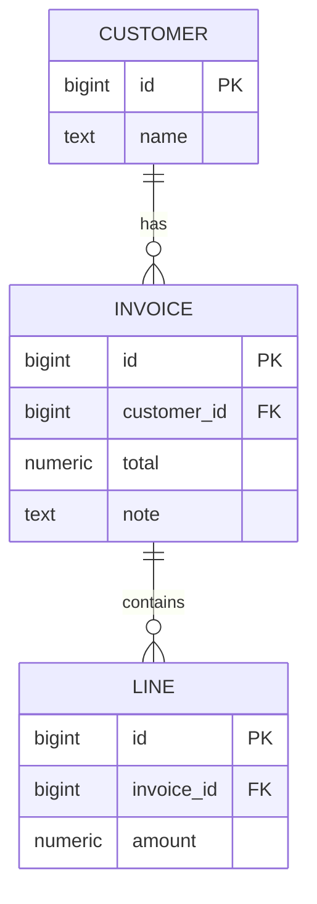

# Tutorial: customers, invoices and computed columns

Build a small application using configuration, live tables, relations, an alias
and correlated formulas. Then insert data, read it back, commit a change and
verify a rollback. The example uses ordinary dictionary results throughout.

You need Python, `asqueel[postgresql]` from this checkout, and a reachable
PostgreSQL **test database** whose role can create schemas. Nothing installs or
starts PostgreSQL automatically. The script creates a uniquely named schema and
removes it in its cleanup block; an interrupted process may leave that schema.

Download {download}`shop_tutorial.py <_examples/shop_tutorial.py>` and run:

```sh
export ASQUEEL_DSN="host=localhost dbname=example user=example"
python shop_tutorial.py
```

The sections below show extracts from that same file, in order. Download the
complete script to run it without assembling fragments. Its assertions check
both returned values and transaction behavior.

## 1. Describe the application model

A customer has invoices; an invoice has lines. The queryable relations in this
model point from an invoice to its customer and from a line to its invoice.
The invoice's line summary is an explicit correlated formula, not an automatic
reverse collection.



Import the public application interfaces and standard Python value types:

:::{literalinclude} _examples/shop_tutorial.py
:language: python
:start-after: "# imports-start"
:end-before: "# imports-end"
:::

Define the model in a recipe. The `columns()` and `virtual_columns()` handles
are each created once per table and then reused:

:::{literalinclude} _examples/shop_tutorial.py
:language: python
:start-after: "# model-start"
:end-before: "# model-end"
:::

Notice the four different invoice column definitions:

| Column | Definition | Stored in PostgreSQL? |
|---|---|---|
| `total` | Ordinary numeric column. | Yes |
| `customer_name` | Alias to `@customer.name`, inheriting target dtype and metadata. | No |
| `double_total` | SQL expression over a local column. | No |
| `line_total`, `has_lines` | Scalar SUM and EXISTS correlated with this invoice. | No |

`#THIS.id` refers to the invoice that owns the formula. `$invoice_id` and
`$amount` refer to the line being examined inside the subquery. An invoice with
no lines has `line_total=None` and `has_lines=False`: SUM over an empty set is
NULL. Use a named subquery and `COALESCE` when the desired result is zero; see
[formulas](formulas.md).

This example supplies its own integer keys. A `dtype` or `pkey` declaration does
not, by itself, allocate identifiers or keep the stored total synchronized with
the lines. The total and the calculated sum are separate values by design.

## 2. Add deployment configuration and render

Keep the schema and connection choice outside the reusable application recipe:

:::{literalinclude} _examples/shop_tutorial.py
:language: python
:start-after: "# deployment-start"
:end-before: "# deployment-end"
:::

The deployment has the same root label, `shop`. Its connection and physical
schema override the parent configuration without discarding the parent's tables.
Application code still uses `sales.invoice`; the actual PostgreSQL schema has a
unique generated name. This is the same mechanism you can use to target a test
or production schema. [Configuration](configuration.md) explains the read stack.

`open_shop()` returns a live database without connecting. It has already resolved
the model, so missing alias targets and invalid declarations can fail here.

## 3. Create the disposable physical tables

The model does not create database objects. This tutorial uses explicit DDL to
make the setup visible and avoid requiring the optional migration package:

:::{literalinclude} _examples/shop_tutorial.py
:language: python
:start-after: "# setup-start"
:end-before: "# setup-end"
:::

Only the generated schema identifier is interpolated here. General identifiers
need proper SQL identifier quoting; bound data parameters do not quote identifiers.
All application values in the following steps go through value mappings or
query parameters. For maintained application schemas, read [migrations](migrations.md).

## 4. Insert related rows in one transaction

:::{literalinclude} _examples/shop_tutorial.py
:language: python
:start-after: "# seed-start"
:end-before: "# seed-end"
:::

The customer rows are inserted before invoices, and invoices before lines, to
satisfy their foreign keys. All writes share an implicit transaction. The explicit `db.commit()` commits
all of them; an error rolls the unit of work back. `Decimal` represents the
amounts without introducing binary floating-point rounding.

## 5. Read through aliases and correlated formulas

:::{literalinclude} _examples/shop_tutorial.py
:language: python
:start-after: "# reads-start"
:end-before: "# reads-end"
:::

The result has two rows, one per invoice. The two lines of invoice 10 do not
multiply its outer result: their SUM is a scalar subquery. The alias generates
a join to the unique customer. No Python row aggregation is involved.

`query.sqltext` compiles without executing. `.fetch()` executes within the
transaction and returns dictionaries. For binding, filtering and pagination,
continue with [queries](queries.md).

## 6. Save a change, then cancel another

:::{literalinclude} _examples/shop_tutorial.py
:language: python
:start-after: "# changes-start"
:end-before: "# changes-end"
:::

`update()` uses the declared key in the mapping when no predicate is supplied.
`record(..., mode='dict')` immediately loads exactly one visible row. The second
update is rolled back by `db.rollback()` in the exception handler. The
final read confirms that the previously committed name remains.

SQL execution errors automatically roll back the selected connection. A Python
exception requires explicit rollback, as above. Named connections and deferred
callbacks are described in the transaction guide.

## 7. Own the lifecycle and clean up

:::{literalinclude} _examples/shop_tutorial.py
:language: python
:start-after: "# run-start"
:end-before: "# run-end"
:::

The outer database context owns closing; the example explicitly commits or
rolls back each unit of work. Cleanup first clears any pending transaction and then removes only
the generated schema. After the printed rows, the script reports:

```text
Tutorial completed; committed writes and rollback verified.
```

## Where to go next

- Add UI metadata, physical naming and shared model helpers: [models](models.md).
- Implement business rules using table subclasses: [hooks](hooks.md).
- Introduce a current organization, drafts and soft deletion: [row policies](row-policies.md).
- Work from an existing PostgreSQL schema: [database inspection](importing.md).
- Check differences before porting existing code: [legacy compatibility](legacy.md).
