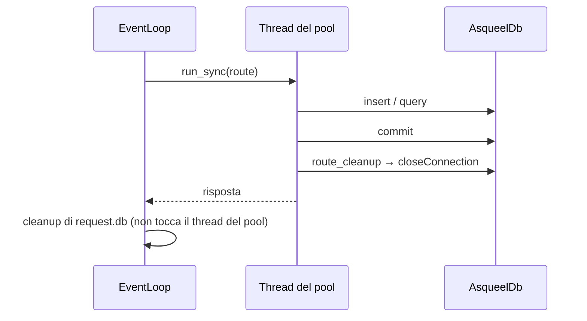

<!-- generated from kajenn-app.xml by xmldocs: do not edit, edit the XML -->

## Salvare dati con Asqueel in un'app kajenn
*Instruction booklet · booklet/kajenn-app · 2026-10-10*

### Purpose

Un'applicazione kajenn salva i propri archivi in SQLite o PostgreSQL attraverso Asqueel. Esempi di archivi: utenti, token, conversazioni.

Il database si dichiara nella configurazione del server, nella sezione `databases`. L'app lo riceve da `_request.db`.

Un archivio passa da filesystem a database cambiando una riga di configurazione. Le route restano uguali.

Kajenn e Asqueel funzionano già così, senza modifiche al codice.

### Requirements

- Python 3.11 o successivo.
- `kajenn` 0.4.1.
- `asqueel` 0.4.0. Per PostgreSQL serve l'extra `asqueel[postgresql]`. SQLite usa `sqlite3` della libreria standard.
- Per creare le tabelle con la CLI serve l'extra `asqueel[migration]`.

#### 1. Dichiarare l'archivio

Il modello e la connessione stanno in una recipe `SqlDatabaseConfig`. Lo schema si chiama `chat` e contiene una tabella `message`.

**Example — Recipe SQLite**

`myapp/archive.py`
```python
from asqueel import SqlDatabaseConfig


class ChatArchive(SqlDatabaseConfig):
    def main(self, root):
        db = root.db()
        db.connection(name="/srv/myapp/data/chat.db", implementation="sqlite")
        columns = db.schemas().schema("chat").tables().table("message", pkey="id").columns()
        columns.column("id", dtype="L")
        columns.column("conversation_id", dtype="T")
        columns.column("text", dtype="T")
```

Su SQLite ogni schema logico è un file separato, collegato con ATTACH. Lo schema `chat` di `chat.db` sta nel file `chat_chat.db`.

Per PostgreSQL la connessione si dichiara con `implementation="postgresql"`, `host`, `user` e `password`. La password va passata con un `EnvResolver`, così il segreto resta fuori dalla recipe.

#### 2. Creare le tabelle

Asqueel non crea tabelle quando costruisce il database. Le crea la CLI di migrazione, partendo dalla recipe.

```console
asqueel db plan --config myapp/archive.py
asqueel db apply --config myapp/archive.py
```

Su SQLite la cartella del file deve già esistere.

#### 3. Registrare il database nel server

Nella configurazione kajenn la sezione `databases` riceve `db_class=AsqueelDb` e la recipe in `source`. Il server chiama `AsqueelDb(source=ChatArchive)` e registra il risultato sotto `code`.

**Example — Configurazione del server**

`myapp/config.py`
```python
from asqueel import AsqueelDb
from kajenn.config import AsgiConfigBuilder

from .app import ChatApp, SqlMessageStore
from .archive import ChatArchive


class Configuration(AsgiConfigBuilder):
    def main(self, root):
        cfg = root.configuration()
        cfg.databases().database(code="default", db_class=AsqueelDb, source=ChatArchive)
        cfg.applications().application(
            code="chat", mount="", app_class=ChatApp,
            message_store_class=SqlMessageStore,
        )
```

Un'app usa il database registrato come `default`. Per usarne un altro, l'app riceve `db_name="<code>"` nella configurazione.

#### 4. Scrivere l'archivio come classe store

L'app non chiama Asqueel direttamente nelle route. Chiama una classe store, con metodi propri dell'archivio. La classe store riceve il database nel costruttore.

**Example — Store su database**

`myapp/app.py`
```python
class SqlMessageStore:
    def __init__(self, db):
        self.db = db

    def append(self, conversation_id, text):
        self.db.table("chat.message").insert(
            {"conversation_id": conversation_id, "text": text})
        self.db.commit()

    def history(self, conversation_id):
        return self.db.table("chat.message").query(
            columns="$id, $text", where="$conversation_id = :cid",
            cid=conversation_id, order_by="$id").fetch()
```

Uno store su filesystem ha gli stessi metodi e ignora `db`. Per passare da filesystem a database si cambia solo `message_store_class` nella configurazione.

#### 5. Usare lo store nelle route

L'app riceve la classe store come argomento del costruttore. Le route sono sync e costruiscono lo store con `_request.db`.

**Example — Applicazione**

`myapp/app.py`
```python
from genro_routes import route
from kajenn import RoutedApplication


class ChatApp(RoutedApplication):
    def __init__(self, message_store_class=None, **kwargs):
        self.message_store_class = message_store_class
        super().__init__(**kwargs)

    def store(self, request):
        return self.message_store_class(request.db)

    @route()
    def post(self, conversation_id: str, text: str, _request=None) -> dict:
        self.store(_request).append(conversation_id, text)
        return {"ok": True}

    @route()
    def history(self, conversation_id: str, _request=None) -> list:
        return self.store(_request).history(conversation_id)
```

#### 6. Chiudere la connessione sul thread della route

Kajenn esegue una route sync su un thread del pool. Asqueel tiene una connessione per thread. La connessione va chiusa su quel thread, in `route_cleanup`.

**Example — Chiusura in route_cleanup**

`myapp/app.py`
```python
class ChatApp(RoutedApplication):
    ...

    def route_cleanup(self):
        self.server.databases["default"].closeConnection()
```

`closeConnection` fa rollback del lavoro non committato e rilascia le connessioni del thread. Il database resta utilizzabile per la richiesta successiva.


*Una richiesta sync*

### Rules

- **must** — Usare Asqueel solo da route sync. *(route_cleanup gira solo dopo una route sync; una route async non ha un punto di chiusura sul proprio thread.)*
- **must** — Fare `commit()` esplicito alla fine di ogni unità di lavoro. *(execute() e le scritture non fanno mai commit da soli; closeConnection annulla il lavoro non committato.)*
- **must** — Chiudere le connessioni in `route_cleanup`, sullo stesso thread della route.
- **must** — Passare i valori esterni come parametri (`:cid`), mai dentro il testo SQL. *(I valori interpolati nel testo SQL sono codice; i parametri no.)*
- **must-not** — Fare query durante la costruzione del server o nel processo template di kajenn-orchestra, prima del fork dei worker. *(Una connessione aperta prima del fork verrebbe condivisa tra processi.)*
- **should** — Tenere brevi le unità di lavoro su SQLite. Con molti writer concorrenti usare PostgreSQL. *(Su SQLite ogni unità di lavoro apre con BEGIN IMMEDIATE, anche per una sola lettura, e blocca gli altri writer fino al commit o al rollback.)*
- **should** — Usare un solo `AsqueelDb` per database, condiviso da tutti i thread.

### Current limits

- La cleanup che `_request.db` registra gira sul thread dell'event loop. Lì non ci sono connessioni Asqueel, quindi non chiude quella del thread del pool. Per questo serve `route_cleanup`. · `kajenn/src/kajenn/server.py:416`
- Uno `store_class` per `users` o `tokens` riceve lo storage del server e le opzioni, non il registro `databases`. Uno store SQL per questi archivi oggi deve costruirsi un proprio `AsqueelDb`. · `kajenn/src/kajenn/auth/mixin.py:191`
- Lo store dei task è `FileTaskStore`, fisso nel codice. La configurazione non lo può sostituire. · `kajenn/src/kajenn/tasks/manager.py:92`
- Asqueel non ha API async, streaming dei risultati né pool di connessioni. I risultati sono liste di dict materializzate in memoria. · `docs/guide/limitations.md`
- Asqueel naviga solo relazioni to-one. Per leggere i figli di un record si interroga la tabella figlia con un filtro sulla chiave, come in `history`. · `docs/guide/limitations.md`
- Un update o un delete ordinario tocca esattamente una riga, identificata dalla chiave primaria. · `docs/guide/limitations.md`
- La grammatica di Asqueel è in revisione. Le firme possono cambiare tra una release e l'altra. · `docs/guide/limitations.md`

### Verified facts

- `READ` `kajenn/src/kajenn/asgi_server.py:223` · 2026-10-10 — Il server costruisce ogni database come `db_class(**params)` e lo avvolge in `AsgiDbHandlerBase`, che inoltra gli attributi pubblici.
- `READ` `kajenn/src/kajenn/routed_application.py:351` · 2026-10-10 — `route_cleanup` gira sullo stesso thread del pool che ha eseguito la route sync. Non gira per le route async.
- `READ` `src/asqueel/runtime.py:34` · 2026-10-10 — Asqueel tiene le connessioni in uno stato per thread (`threading.local`).
- `RUN` `probe con httpx.ASGITransport su kajenn 0.4.1 e asqueel main 6567e95` · 2026-10-10 — L'app di questo booklet ha risposto 200 a due `post` e a `history`. `history` ha restituito le due righe in ordine.
- `RUN` `probe con httpx.ASGITransport su kajenn 0.4.1 e asqueel main 6567e95` · 2026-10-10 — Route e `route_cleanup` sono girate sullo stesso thread (`kajenn-pool_0`). Dopo `closeConnection` le connessioni del thread sono passate da 1 a 0.

### Decisions

- **d-config-grammar** `open` — Il modello Asqueel si scriverà dentro la configurazione kajenn, come `storage`, invece che in una recipe separata? Finché la decisione è aperta, vale la recipe descritta in Dichiarare l'archivio (→ s-recipe).
